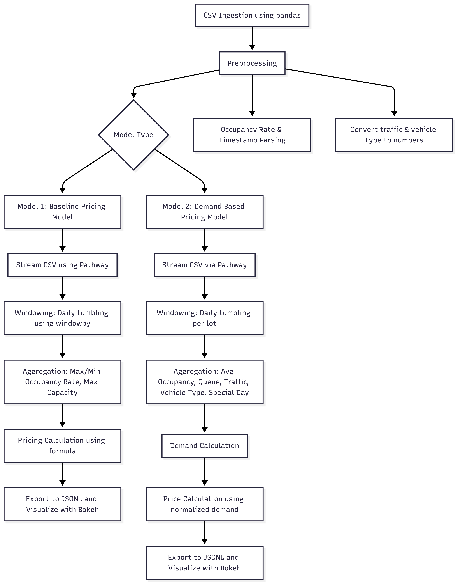

# 🚗 Dynamic Parking Pricing System (Real-Time with Pathway & Bokeh)

This project implements a **real-time dynamic parking pricing model** that adjusts parking fees based on factors like demand, traffic, queue length, special events, and vehicle type. The goal is to optimize resource usage, reduce congestion, and improve user experience by simulating real-world parking dynamics using streaming data.

---

## 📌 Key Features

- ⏱️ Real-time processing using [Pathway](https://github.com/pathwaycom/pathway)
- 📊 Interactive visualizations with **Bokeh + Panel**
- 🧠 Two pricing models: **Baseline** and **Demand-Based**
- 💸 Prices remain fair: always between **0.5× and 2×** of the base price

---

## 📂 Dataset Overview

### 🔹 Source

- **File**: `dataset.csv`
- **Format**: CSV
- **Total Rows**: ~18,368
- **Locations**: 14 unique parking lots (`SystemCodeNumber`)

### 🔹 Columns

| Column                | Description                                             | Type     |
|-----------------------|---------------------------------------------------------|----------|
| `SystemCodeNumber`    | Unique ID for each parking lot                          | string   |
| `Latitude`            | Latitude of parking lot                                 | float    |
| `Longitude`           | Longitude of parking lot                                | float    |
| `LastUpdatedDate`     | Timestamp of the occupancy data                         | string   |
| `Occupancy`           | Number of parked vehicles                               | int      |
| `Capacity`            | Total capacity of the lot                               | int      |
| `QueueLength`         | Vehicles waiting to park                                | int      |
| `TrafficConditionNearby` | Traffic condition (Low / Average / High)           | string   |
| `IsSpecialDay`        | Indicates if it's a holiday/festival                    | boolean  |
| `VehicleType`         | Type of vehicle (Cycle, Bike, Car, Truck)              | string   |

### 🔹 Engineered Features (via Pathway UDFs)

| Feature         | Description                                                    |
|----------------|----------------------------------------------------------------|
| `OccupancyRate`| `Occupancy / Capacity`                                         |
| `TrafficLevel` | Encoded: Low → 0, Average → 1, High → 2                        |
| `VehicleFactor`| Encoded: Cycle → 0, Bike → 1, Car → 2, Truck → 3              |
| `day_id`       | Unique ID per lot per day                                      |
| `instance`     | Time-based real-time windowing                                 |
| `Timestamp`    | Parsed event timestamp (`%Y-%m-%d %H:%M:%S`)                   |

---

## 🛠️ Tech Stack

| Component         | Tool / Library    | Purpose                            |
|------------------|-------------------|------------------------------------|
| Real-time Engine | Pathway           | Streaming + windowed processing    |
| Visualization    | Bokeh, Panel      | Web-based visualizations           |
| Data Handling    | Pandas, NumPy     | Data manipulation                  |
| Storage          | CSV, JSONL        | I/O operations                     |
| Notebook         | Google Colab      | Development environment            |

---

## 🧠 Model 1: Real-Time Baseline Pricing

This model adjusts base price based on daily **occupancy volatility** using **Pathway's tumbling windows**.

### ⚙️ Formula

```python
price = base_price + (occ_max - occ_min) / capacity
```

### 🔁 Flow

1. Ingest CSV with Pandas
2. Feature engineer occupancy rates & timestamp
3. Stream with Pathway
4. Apply daily `windowby()`
5. Aggregate max/min occupancy
6. Calculate price
7. Export (JSONL) and plot (Bokeh)

### 📌 Insights

- Higher volatility → Higher prices
- Responds to day-wise demand changes

---

## ⚡ Model 2: Demand-Based Dynamic Pricing

This model uses multiple **urban demand signals** to dynamically compute pricing.

### 📊 Demand Function

```python
Demand = α*(Occupancy/Capacity) + β*QueueLength − γ*TrafficLevel + δ*IsSpecialDay + ε*VehicleTypeWeight
```

**Weights:**

- α = 5.0 (occupancy)
- β = 0.4 (queue)
- γ = 1.5 (traffic penalty)
- δ = 2.0 (special days)
- ε = 1.0 (vehicle type)

### 💰 Pricing Formula

```python
price = base_price * (1 + λ * NormalizedDemand)
```

- `base_price` = 10
- `λ` = 0.2
- Demand is normalized to [0.0, 1.0]
- Final price clipped to [0.5×, 2× base]

### 🔁 Flow

1. Ingest & preprocess
2. Encode traffic & vehicle
3. Compute `OccupancyRate`, timestamp
4. Stream with Pathway
5. Window + aggregate relevant metrics
6. Compute demand
7. Calculate price
8. Export (JSONL) and visualize (Bokeh)

### 📌 Insights

- Responsive to real-world signals
- Shows nuanced pricing
- Prioritizes fairness and efficiency

---

## 🏗️ Architecture Diagram



---

## 🚀 Future Improvements

- Add **Competitive Pricing Model** based on nearby lots (via lat-long proximity)
- Use **real traffic APIs** for better congestion data
- Incorporate **predictive models** for occupancy forecasting
- Optimize for rerouting and user preferences

---

## 📎 Project Structure (Suggested)

```
📁 dynamic-parking-pricing/
│
├── 📄 README.md
├── 📄 requirements.txt
├── 📁 data/
│   └── dataset.csv
├── 📁 notebooks/
│   └── dynamic_pricing.ipynb
├── 📁 src/
│   ├── baseline_model.py
│   ├── demand_model.py
│   └── utils.py
├── 📁 outputs/
│   └── prices.jsonl
└── 📁 visuals/
    └── architecture_diagram.png
```

---

## 🧾 License

This project is released under the MIT License.
